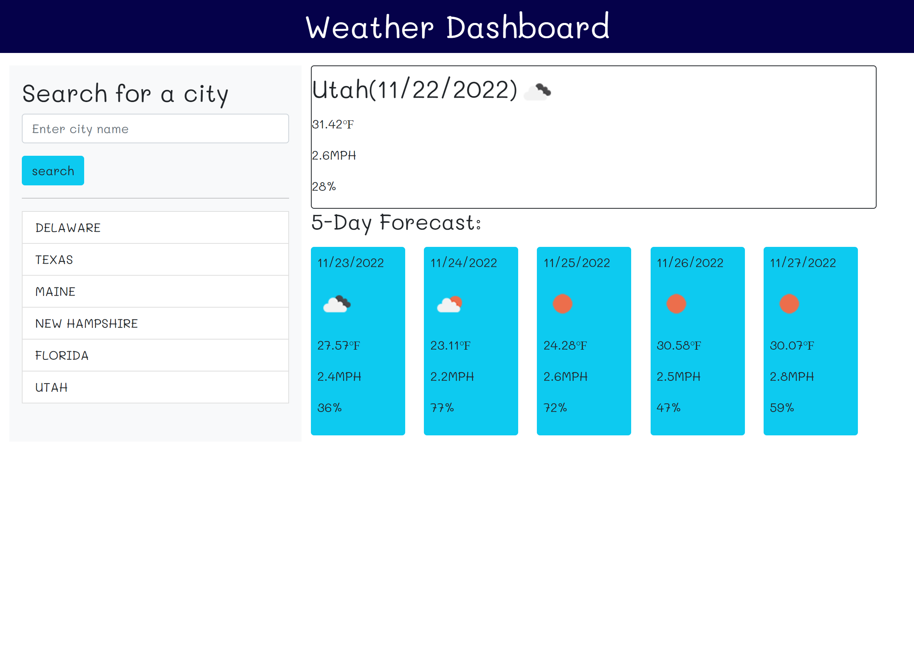

# Weather Dashboard

## Description

The motivation and purpose behind this project was to create a weather dashboard that can show the current weather, as well as the weather for the next five days. Regardless of what state is entered into the search field, the weather data should populate for that state. I learned a lot about properly linking apis and centering an app around them. I also learned a lot about bootstrap and using jquery to style and create elements.

## Usage

To get started all you have to do is type any state into the search field and click the search button. The state entered will populate below the search button into a list, which is clickable. If you want to see the weather of a previous state that you entered, all you have to do is click the name of that state from the list.

[Link to deployed app](https://m-dickerson.github.io/weather-dashboard/)

## License

MIT License

A short and simple permissive license with conditions only requiring preservation of copyright and license notices. Licensed works, modifications, and larger works may be distributed under different terms and without source code.